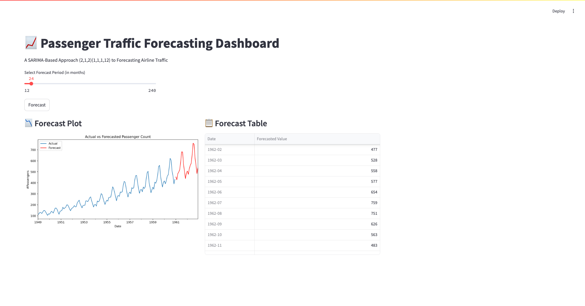

## Airline Passenger Traffic Forecasting Dashboard
This project presents an interactive web application built with Streamlit for forecasting airline passenger traffic. It utilizes a SARIMA (Seasonal Autoregressive Integrated Moving Average) model to predict future passenger counts based on historical data.

### Features
- Interactive Forecasting: Select your desired forecast period (in months) using a slider.
- SARIMA Model: Employs a pre-defined SARIMA(2,1,2)(1,1,1,12) model for robust time series forecasting.
- Dynamic Visualizations: View a clear plot comparing actual passenger data with the model's forecasts.
- Tabular Forecasts: Get a precise, rounded table of future passenger count predictions.
- Caching for Performance: Uses Streamlit's @st.cache_data to efficiently load the dataset.

### How to Run

Follow these steps to get the project up and running on your local machine:

1. Clone the Repository
```
git clone git@github.com:neethu-codes/AirlineTrafficForecast.git
cd AirlineTrafficForecast
```

2. Create aand activate the Virtual Environment 
```
python -m venv venv
source venv/bin/activate # On macOS/Linux:
.\venv\Scripts\activate # On Windows
```

3. Install Dependencies
```
pip install -r requirements.txt
```

4. Prepare the Data

Ensure you have the AirPassengers.csv file in the root directory of your project. This file is crucial for the application to load and process the historical data.

5. Run the Streamlit Application
```
streamlit run app.py
```


### Technologies Used
- Streamlit: For creating the interactive web application interface.
- Pandas: For data manipulation and analysis, especially with time series data.
- NumPy: For numerical operations, particularly for logarithmic transformations.
- Matplotlib: For generating the forecast visualization.
- Statsmodels: For implementing the SARIMAX time series forecasting model.

### Project Structure
```
AirlineTrafficForecast/
├── app.py                  # The main Streamlit application file.
                            # This script builds the interactive dashboard for forecasting.
├── AirPassengers.csv       # The dataset containing historical airline passenger data.
                            
├── requirements.txt        # Lists all necessary Python libraries that this project depends on
                            
├── README.md               # The project's main documentation having an overview,
                            # setup instructions, features, and how to run the application.
├── Final_Air_Passenger_Timeseries_Forecast.ipynb # A Jupyter Notebook file containing
                                                # exploratory data analysis, model prototyping,
                                                # and detailed methodology for the forecasting.
```

## App Screenshot
Here's a glimpse of the Streamlit application interface:


